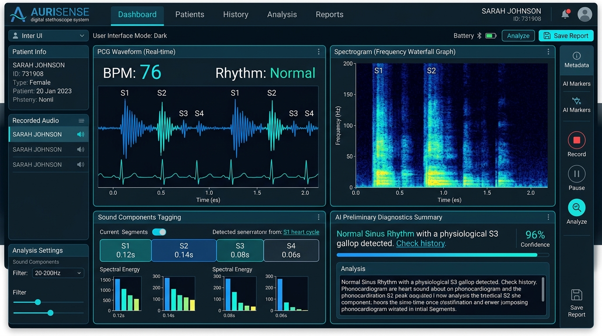
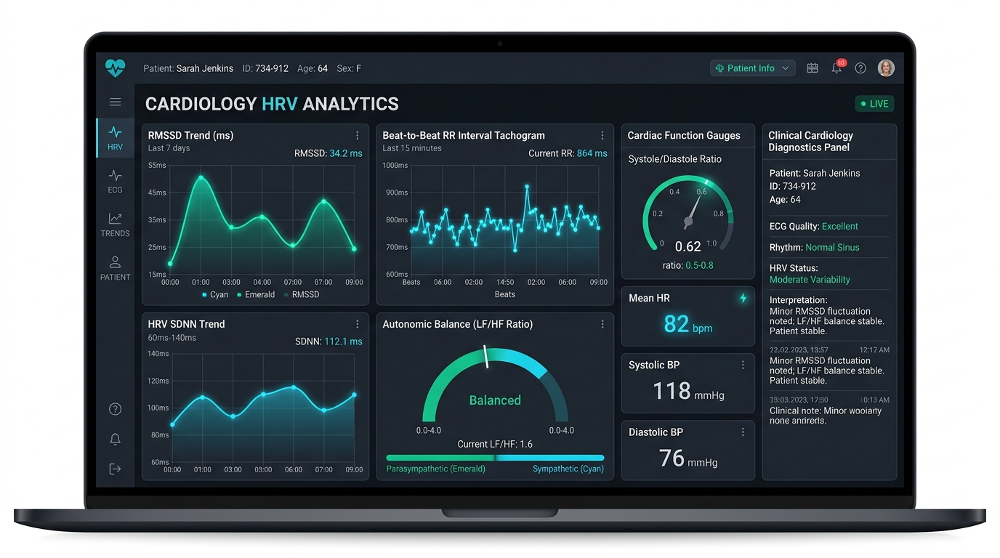
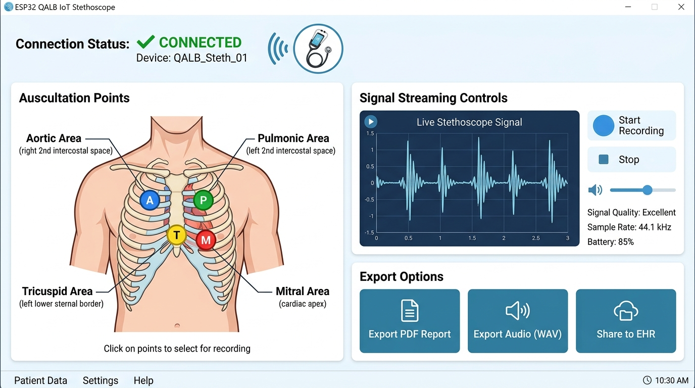

# QALB — Fonokardiografiya (FKG / PCG) va AI Kardiologik Tahlil Tizimi

Ushbu loyiha yurak tovushlari (Fonokardiografiya — FKG / PCG), RMSSD va HRV (Yurak Ritmi O'zgaruvchanligi) dinamikasini real vaqtda tahlil qiluvchi hamda **ESP32 asosidagi "QALB" portativ aqlli stetoskopi** bilan to'liq integratsiyalashgan zamonaviy tibbiy platformadir.

---

## 📸 Platforma Skrinshotlari

### 1. Asosiy Boshqaruv Paneli va Real-Vaqt FKG To'lqin Shakli
> Yurak auskultatsiya nuqtalarini tanlash, real-vaqtda akustik to'lqin shakli, S1/S2 tonlar segmentatsiyasi va FFT spektrogrammasi.



---

### 2. RMSSD va HRV Dinamikasi (Yurak Ritmi O'zgaruvchanligi Trendi)
> Recharts yordamida har bir yurak sikli (Beat-to-Beat RR tachogram), RMSSD, SDNN, vegetativ asab tizimi (Vagus/Simpatik) balansi va ritm disritmiyasi tahlili.



---

### 3. ESP32 "QALB" IoT Qurilmasi Bilan Sinxronizatsiya
> Simsiz ESP32 stetoskopi holati, telemetriya buyruqlari, anatomik auskultatsiya xaritasi va avtomatlashtirilgan ZIP eksporti.



---

## 🌟 Asosiy Imkoniyatlar

1. **FKG To'lqin Shakli va FFT Spektrogrammasi**:
   - Web Audio API orqali yuqori aniqlikdagi audio tahlil va shovqinlarni filtrlash.
   - S1, S2, S3, S4 tonlari va sistola/diastola oraliqlarini avtomatik aniqlash.
   - 20 Hz dan 800 Hz gacha bo'lgan yurak akustik chastota spektrini vizualizatsiya qilish.

2. **RMSSD va HRV Dinamikasi (Recharts Trend)**:
   - Ketma-ket RR intervallar mikrotebranishlari (*Beat-to-Beat tachogram*).
   - RMSSD, SDNN, pNN50 va vegetativ nerv balansi (Vagus / Simpatik tonus) bahosi.
   - 3 xil interaktiv rejim: RR trendi (ms), $|\Delta RR|$ farqlar gistogrammasi va lahzalik BPM.

3. **ESP32 "QALB" Qurilmasi Integratsiyasi**:
   - Wi-Fi va HTTP protokollari orqali ESP32 bilan ikki tomonlama real-vaqt aloqa.
   - Masofadan turib yozish buyruqlari (`START_RECORDING`, `SET_GAIN`, `SET_FILTER`).
   - Xom PCM/WAV signallarini qabul qilish va avtomatik ravishda chuqur AI tahliliga yo'naltirish.
   - Yozuvlarni to'liq metadata, audio fayli va JSON xulosalari bilan ZIP arxiv shaklida yuklab olish.

4. **Gemini AI Kardiologik Xulosa va Konsultatsiya**:
   - XXT-10 (ICD-10) xalqaro kodlari bilan differensial tashxislar.
   - S1/S2 patologiyalari, sistolik/diastolik shovqinlar (Levine shkalasi) bahosi.
   - AI Kardiolog bilan interaktiv savol-javob (chat) va tavsiyalar.

---

## 🛠 Texnologiyalar

- **Frontend**: React 18, TypeScript, Tailwind CSS, Lucide Icons, Recharts, Motion
- **Backend / API**: Node.js, Express, Google GenAI SDK (`@google/genai`), esbuild
- **Audio & DSP**: Web Audio API, Fast Fourier Transform (FFT), STFT Hann Window
- **Apparat Ta'minoti**: ESP32, I2S Digital Microphone, Wi-Fi Telemetriya

---

## 🚀 O'rnatish va Mahalliy Ishga Tushirish

### 1. Repozitoriyani klonlash
```bash
git clone https://github.com/<sizning-username>/qalb-cardio-ai.git
cd qalb-cardio-ai
```

### 2. Bog'liqliklarni o'rnatish
```bash
npm install
```

### 3. Muhit o'zgaruvchilarini sozlash
`.env.example` faylidan nusxa olib, `.env` faylini yarating:
```bash
cp .env.example .env
```
`.env` faylida o'zingizning Google Gemini API kalitingizni kiriting:
```env
GEMINI_API_KEY=your_gemini_api_key_here
```

### 4. Dasturni ishga tushirish (Dev rejimida)
```bash
npm run dev
```
Dastur `http://localhost:3000` manzilida ishga tushadi.

### 5. Ishlab chiqarish (Production build)
```bash
npm run build
npm start
```

---

## 📄 Litsenziya
MIT License
